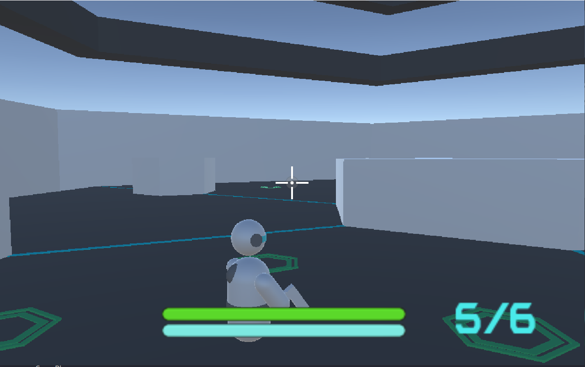
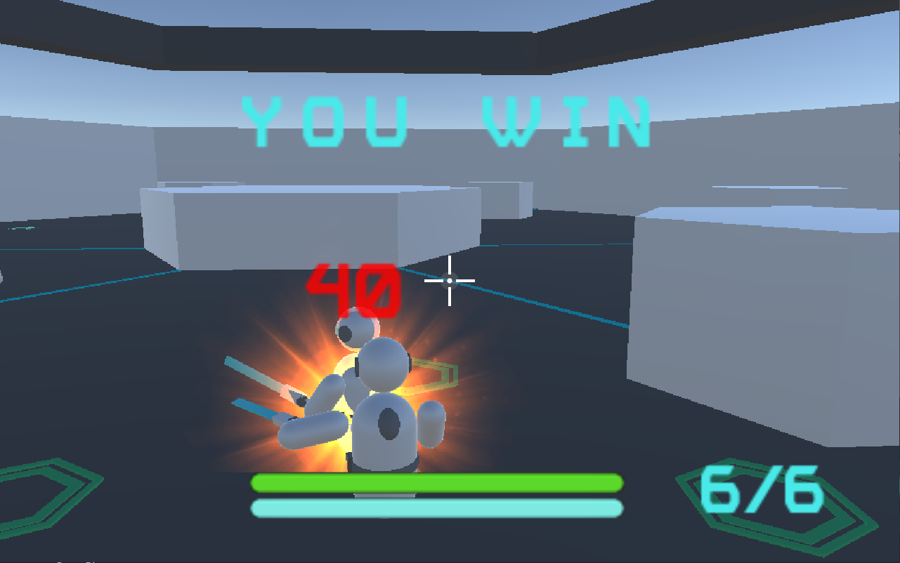
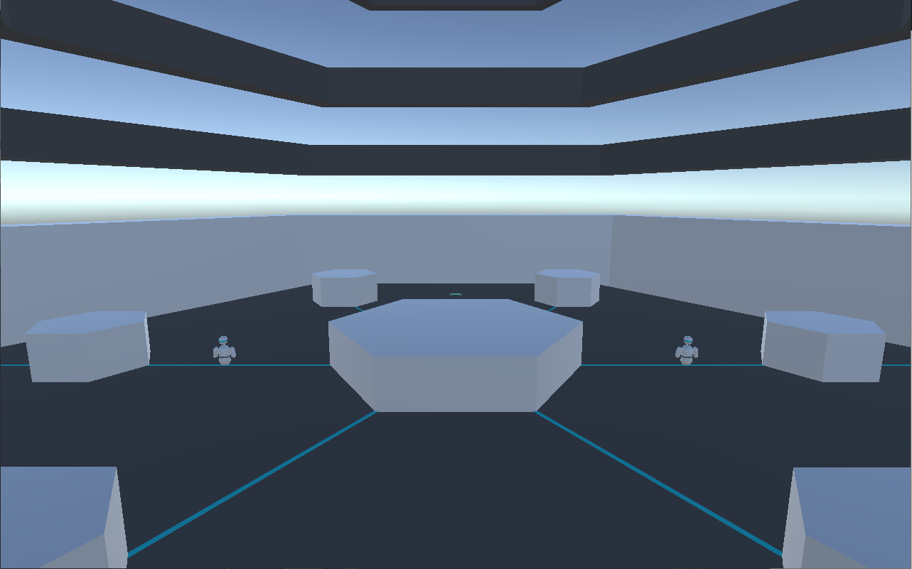
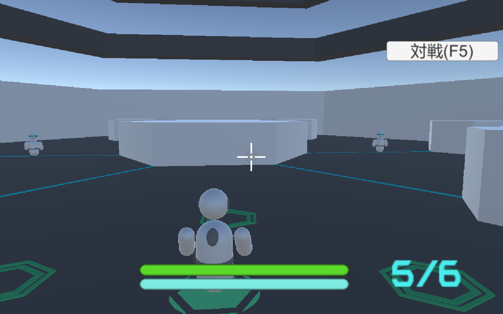
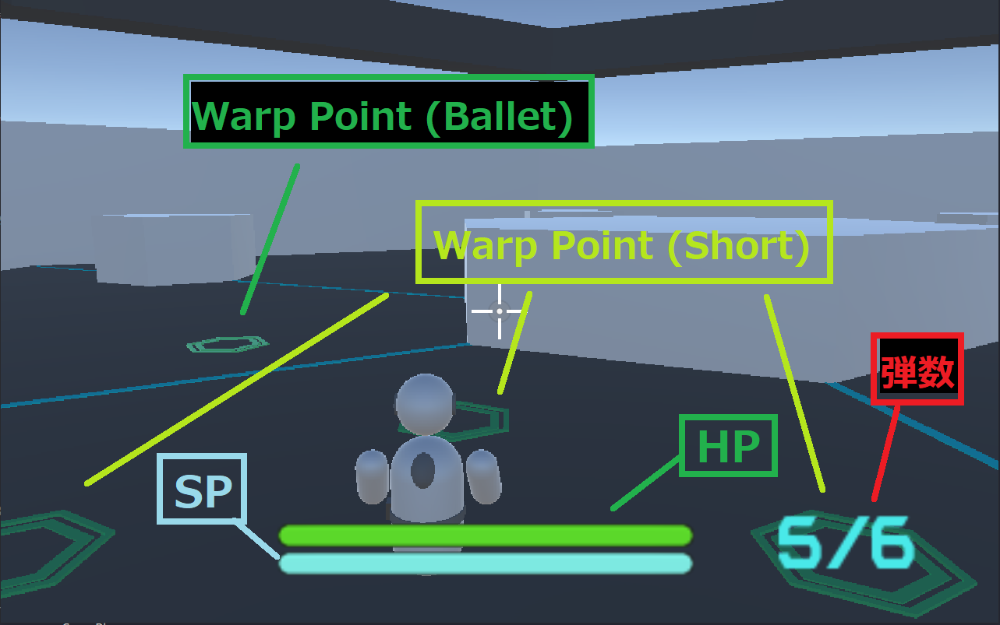

# Teleporter

  
  

Teleporterは2人対戦用TPSゲームで、プレイヤーは「テレポート」は駆使して戦います。
 windows10のみプレイが可能です。
 まだ、開発途中のため、オンライン上に3人以上いるときプレイに支障きたす場合がございます。

# 操作方法
## ホーム画面
起動すると左下の画面になります。左クリックすると右下の画面に移ります。  
また、ESCキーでカーソルのON/OFFができます。

  
  

## 対戦画面
用語については下の画面を参照してください。
 WSADキー:プレイヤーの移動
 W(S/A/D)キー+Space:Warp Point (Short)にテレポート
 左クリック：攻撃
 右クリック：Warp Point (Ballet)を撃つ
 Shiftキー：Warp Point (Ballet)にテレポート
 Rキー：リロード(武器が銃のときのみ)
 スクロール：武器の切り替え
 ESCキー:カーソルのON/OFF

  

